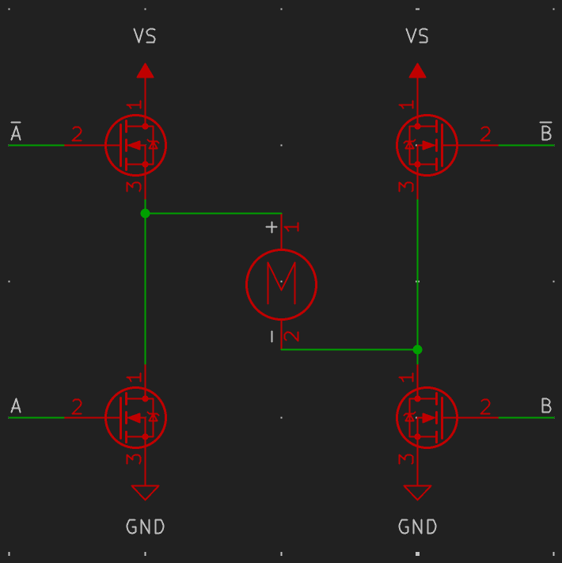

It's time to get our hands dirty and really change this firmware. We're going to make a motor spin, but to do that, firmware won't be enough.

## Preparation

Pick up a **Motion Shield** and:
- 9v battery and connector
- DC motor
- Jumper
- Wires
- Tiny screwdriver


This ^ is the pinout diagram for the motion shield. It shows you how GPIO from the DevBoard are allocated.

We want to spin a motor, so we're going to use one of the motor output ports at the bottom.

## How do motors work?

The standard method of driving DC motors is with a structure called a **Full Bridge**:



There are two output stages that can assert a voltage of either **GND** or **VS**.

If stage **A** is `HIGH` and stage **B** is `LOW`, current would flow through the motor
from `+` to `-` and the motor would exert a torque $\vec \tau$.

If stage **A** is `LOW` and stage **B** is `HIGH`, current would flow through the motor
from `-` to `+` and the motor would exert a torque $-\vec \tau$.

So let's try it. Looking at the bottom of the pinout diagram, we can see which GPIO
correspond to each motor port.

Solder some wires onto your motor and plug them into a motor port. Also, place a jumper
on the enable port for the motor channel you are using.

Let's change our blinky code to configure two more output pins:

```rust
let io = Io::new(peripherals.GPIO, peripherals.IO_MUX);

let mut led = Output::new(io.pins.gpio17, Level::Low);
// add these
let motor_hi = Output::new(io.pins.gpio?, Level::High /* set default pin configuration to HIGH */);
let motor_lo = Output::new(io.pins.gpio?, Level::Low);
```

Run this, and watch the motor spin!

You can reverse the direction by inverting the levels of these pins. Try it!

## Greater Granularity

You don't *always* want to exert maximum torque in either direction, but rather some
*proportion* of the maximum torque.

To achieve this, we can use **P**ulse **W**idth **M**odulation (PWM).

Rather than holding the output stages steady at `HIGH` or `LOW`, we can rapidly
change the state, targeting an on *proportion*.

Imagine we hold stage **B** `LOW`, and over intervals of `1us`, pull stage **A** `HIGH` for `200ns`
and `LOW` for the remaining `800ns`. *On average*, it would look as though the voltage on the switch
node of stage A were $V_s \cdot \frac{200ns}{1us}=0.2V_s$, which roughly corresponds to 1/5th
the maximum torque.

ESP32s actually have a peripheral specifically for generating PWM control signals for motors, the
peripheral is appropriately named `MCPWM`.

Let's configure it!

First up, let's add a new crate `fugit`, which provides us with some convenient
integer trait extensions for providing units of time. We'll use this later.

```sh
cargo add fugit
```

Then import the extension trait[^1] at the top of the file:

```rust
use fugit::RateExtU32;
```

Go back to where we defined the motor pins and rewrite it like this:

```rust
let motor_hi_pin = io.pins.gpio13;
let motor_lo_pin = io.pins.gpio14;
```

Rather than being standard outputs, we'll make these pins available to the MCPWM peripheral.

Now let's set up the MCPWM peripheral for use.

The MCPWM peripheral's clock is sourced from the `crypto_pwm_clock`, we can verify
its speed:

```rust
println!("src clock: {}", clocks.crypto_pwm_clock);
```

You should see:

```
src clock: 160000000 Hz
```

since the default system clock configuration is `160MHz` and the `crypto_pwm_clock`
default prescaler is `Div1`.

> It's important that we check these things because we are going to try to achieve
> a target PWM frequency, which is going to be sourced from the peripheral's
> source clock.

Now, we configure our peripheral (the MCPWM) clock:

```rust
let clock_cfg = PeripheralClockConfig::with_frequency(&clocks, 32.MHz()).unwrap();
```

> If we hadn't imported the fugit integer extension trait, we would have encountered
> error code [E0599](https://doc.rust-lang.org/error_codes/E0599.html) from our usage
> of `.MHz()` because Rust can only find trait methods if the trait is in scope.

This function solves for the appropriate prescaler to achieve a frequency of `32MHz`.
(In this case, `Div5`)

> You could just specify the prescaler by using `with_prescaler` and avoid unnecessary runtime fallibility!

Now let's initialize the peripheral with this clock configuration:

```rust
let mut mcpwm = McPwm::new(peripherals.MCPWM0, clock_cfg);
```

Then attach a timer to an operator:

```rust
mcpwm.operator0.set_timer(&mcpwm.timer0);
```

MCPWM's operators control two pins (convenient!) each and require a timer to fascilitate operation.

```rust
let (mut motor_hi, mut motor_lo) = mcpwm.operator0.with_pins(
    motor_hi_pin,
    PwmPinConfig::UP_ACTIVE_HIGH,
    motor_lo_pin,
    PwmPinConfig::UP_ACTIVE_HIGH,
);
```

And now we create a PWM configuration from our clock configuration:

```rust
let timer_clock_cfg = clock_cfg
    .timer_clock_with_frequency(u8::MAX as u16, PwmWorkingMode::Increase, 20.kHz())
    .unwrap();
```

`u8::MAX as u16` sets the maximum duty cycle value. You can change this to whatever you want.
The greater this number, the higher the resolution. I decided an 8bit unsigned integer
is a reasonable duty cycle space.

We can use this configuration to initiate PWM operation:

```rust
mcpwm.timer0.start(timer_clock_cfg);
```

And finally, configure the duty cycles. Let's spin in a direction at full torque:

```rust
motor_hi.set_timestamp(255);
motor_lo.set_timestamp(0);
```

Run this and watch the motor spin!

Swap these numbers and watch it spin the other way!

## Challenge

Make the motor smoothly oscillate back and forth between spinning forward and backward.

[^1]: An extension trait is a trait that extends the capability of primitive types.
